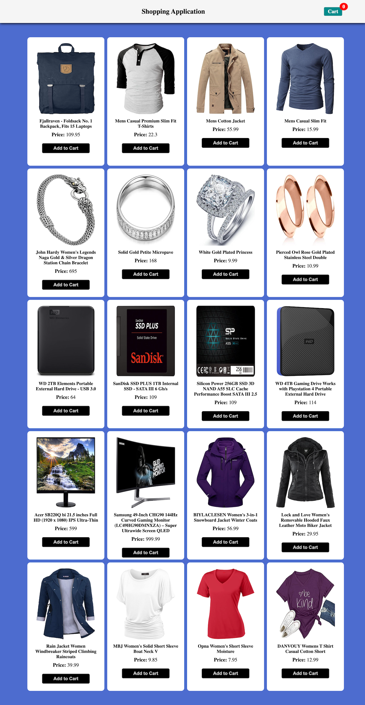
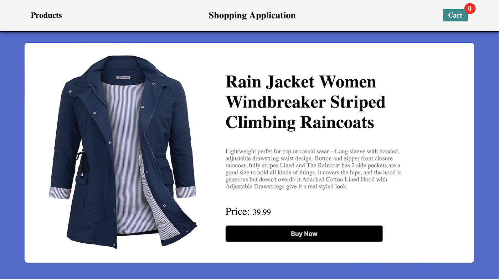

# Shopping Application - Vanilla JS

This is a simple website built using HTML, CSS, and JavaScript to fetch and display products from the "https://fakestoreapi.com/products" API.

 

## Features:
- All Products' data is fetched from the "https://fakestoreapi.com/products" API.
- HTML, CSS, and JavaScript to used achieve the desired layout and functionality.
- Implemented error handling with **"catch()"** method to handle any issues with API requests.
- Users can add a product to cart.
- Users can click on a product's image or title to see detailed view of a product.

 

## Screenshots

 

 

## **Deployed Link :**
